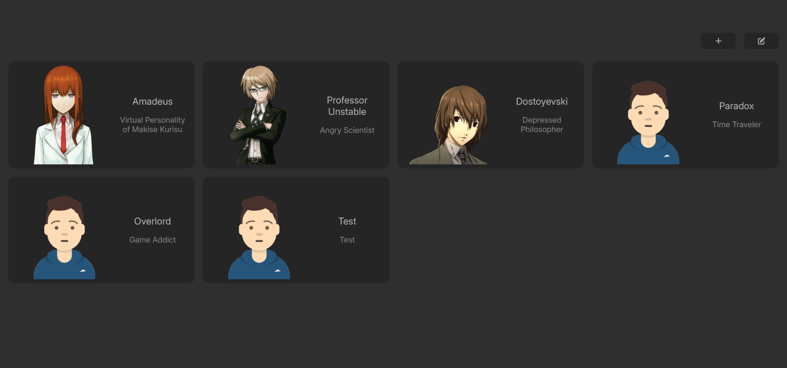

<p align="center">
	<h1 align="center">AI Characters</h1>
	<p align="left">
This project allows you to chat with AI characters with unique personalities and display their emotions through avatars. You can start chatting with preset characters or create your own character with personalities and emotions of your choice. Remember, there's only one limit when creating a character - your imagination!
	</p>
</p>

<p align="center">
    <b>🎬<a href="https://www.youtube.com/watch?v=yPxERx36ylQ">See how it works!</a></b>
</p>

<p align="center">
    <a href="https://www.youtube.com/watch?v=yPxERx36ylQ">  </a>
</p>

## Dependencies:

 - Node v20.17.0
 - React v18.3.1
 - npm v10.8.3

## Getting Started

- If you don't have necessary dependencies, please install them.
<br />

- Clone the project:
	```
	git clone https://github.com/ekinutkuu/AI_Characters
	```
<br />

- Install the packages:
	```
	cd AI_Characters
	cd frontend/
	npm install
	cd ../backend/
	npm install
	```
<br />

- AI Characters uses the <b>Gemini API</b>, so before using it you have to create a [Gemini API Key](https://aistudio.google.com/app/apikey) and apply it.

	**How to apply your API key**

	- in `AI_Characters/backend/api_key.js`
	- paste your api key here:
		```
		const API_KEY = {
		   GEMINI_API_KEY: "your_api_key_here"
		};
		```
<br />

- You're ready to run!
	```
	cd frontend/
	npm start
	```
	```
	cd backend/
	node server.js
	```